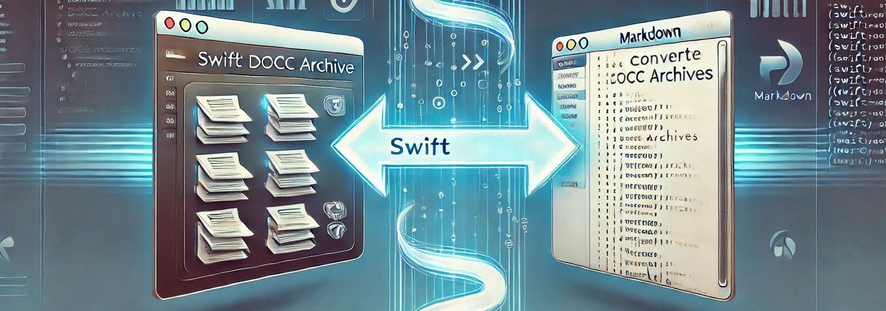

*Command-line Tool*

# docc2md

Make Swift DocC usable outside of Xcode and complicated web hosting. This project is a command-line tool written in Swift, named docc2md, designed to convert Swift’s .doccarchive documentation files into a more portable Markdown format. What you are reading right now is generated by the tool.

## Overview

Swift DocC is a great way to document your Swift project. It enables auto-generating documentation from code commenting combined with articles and more using markdown. It looks beautiful when opened in Xcode and everyone is happy… until the question of distribution comes up.

Sending a folder named `myproject.doccarchive` may not be an option since you need to add more documentation explaining how to use the documentation. Hosting the embedded webpage is complicated and requires a server set up in a specific way to make it work. And how about private repositories, you don’t host sensitive information on any public server.

## The solution

Markdown is a great format for distributing rich text. It’s lightweight, non-complicated, can be read as is and be understood by humans and be distributed together with source code. Like this project.

Use it in your CI/CD build pipeline, as a cmd tool on your build machine or however you like.

This README was generated by the tool itself but as of now it does not look very fun. I need to put some effort into the structure of the project and actual documentation on top of building the tool. Feel free to contribute.

## Usage

First generate the DocC archive.

`$ swift package generate-documentation`

Then use docc2md excecutable to convert the archive to a markdown README.

`$ docc2md [-g/--github] <doccarchivePath> <outputFolder>`

If you skip outputFolder the current dir will be used.

### Example:

For this project the README is generated like this:

`$ swift package generate-documentation` `$ swift run docc2md -g ./.build/plugins/Swift-DocC/outputs/docc2md.doccarchive`

### Options:

-g/–github: Format the markdown for GitHub, enabling dark/light image variants

## Topics

### Structures

- [DocCArchive](docs/docc2md/doccarchive.md) `struct`

### Variables

- [fileManager](docs/docc2md/filemanager.md) `let`

- [help](docs/docc2md/help.md) `let`

- [inputPath](docs/docc2md/inputpath.md) `let`

- [isForGitHub](docs/docc2md/isforgithub.md) `let`

- [outputPath](docs/docc2md/outputpath.md) `var`

### Functions

- [copyImages(from:to:)](docs/docc2md/copyimages(from:to:).md) `func`

  Copies the ‘images’ folder from the archive folder to the output folder.

- [fixLinks(_:relativeTo:)](docs/docc2md/fixlinks(_:relativeto:).md) `func`

  Fixes the links in the given markdown content to be relative to the specified output path.

- [generateMarkdown(from:)](docs/docc2md/generatemarkdown(from:).md) `func`

  Generates Markdown from a given DocC archive.

- [processJsonFile(at:to:)](docs/docc2md/processjsonfile(at:to:).md) `func`

  Processes a JSON file from the specified input path and writes the result to the specified output path.

- [processJsonFolder(at:to:moduleName:)](docs/docc2md/processjsonfolder(at:to:modulename:).md) `func`

  Processes JSON files in the specified data folder and outputs the results to the specified output folder.

- [relativePath(from:toPath:)](docs/docc2md/relativepath(from:topath:).md) `func`

  Computes the relative path from a base URL to a target URL.

### Enumerations

- [Docc2mdError](docs/docc2md/docc2mderror.md) `enum`

